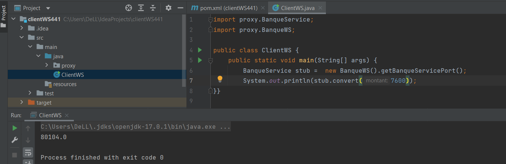

# Activité Pratique N° 3 : Web services SOAP, WSDL, UDDI avec JAXWS

## 1. Creation d'application
### Classe Compte

### Classe BanqueService

### Classe Server

## 2. Consulter et analyser le WSDL avec un Browser HTTP

### Schema 

## 3. Tester les opérations du web service avec un outil comme SoapUI

### importer les API dans SoupUI

&#8594; TEST

** **

&#8594; Client SOAP Java

